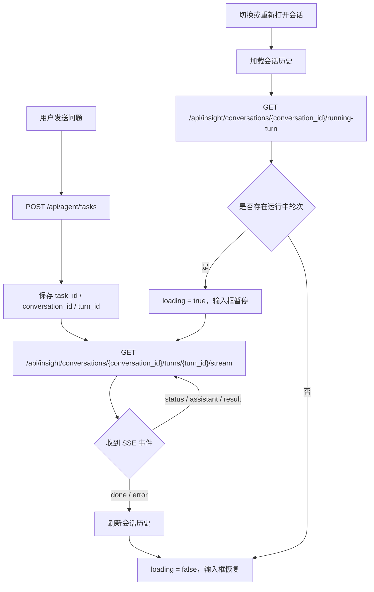

# 前端异步分析任务与 SSE 对接说明

本文档说明前端如何从旧的“提交请求即 SSE 输出”模式，调整为新的“提交后台分析任务 + 按轮次订阅 SSE 输出”模式。

## 1. 核心变化

旧模式：

1. 前端调用 `POST /api/agent/stream`
2. 该 HTTP 连接同时负责触发分析和输出 SSE
3. 页面切换、刷新、关闭后，前端连接断开，流式输出容易丢失

新模式：

1. 前端调用 `POST /api/agent/tasks` 提交分析任务
2. 后端创建会话轮次，后台异步执行分析
3. 前端拿到 `conversation_id`、`turn_id`、`task_id`
4. 前端调用 `GET /api/insight/conversations/{conversation_id}/turns/{turn_id}/stream` 订阅该轮次 SSE 输出
5. 页面切换回来时，先查 `running-turn`，如果有未完成轮次，再重新订阅 SSE

关键点：

- 输入框是否禁用，应由当前会话是否存在运行中轮次决定。
- SSE 连接只负责展示输出，不再决定后端分析任务是否继续执行。
- SSE 异常断开时，不要直接认为分析失败，应先查任务状态。

## 2. 前端 API 封装

建议在 `frontend/src/api/agent.js` 中保留以下方法：

```js
export function submitAgentTask(params) {
  return api.post('/agent/tasks', params)
}

export function getAnalysisTask(taskId) {
  return api.get(`/agent/tasks/${taskId}`)
}

export function getRunningTurn(conversationId) {
  return api.get(`/insight/conversations/${conversationId}/running-turn`)
}

export function streamTurnEvents(conversationId, turnId, onMessage, onError, onDone) {
  return streamGetRequest(
    `${API_BASE_PATH}/insight/conversations/${conversationId}/turns/${turnId}/stream`,
    onMessage,
    onError,
    onDone
  )
}

export function submitRerunTurnTask(conversationId, turnId) {
  return api.post(`/insight/conversations/${conversationId}/turns/${turnId}/rerun/task`, {})
}
```

旧方法 `streamAgent`、`streamRerunTurn` 可以暂时保留兼容，但主流程不再使用。

## 3. 页面状态建议

前端至少维护以下状态：

```js
const loading = ref(false)
const currentTaskId = ref('')
const currentTurnId = ref(0)
const currentStreamController = ref(null)
const currentRunMode = ref('new') // new | rerun
```

含义：

- `loading`
  - 当前会话是否处于分析中
  - `true` 时禁用聊天输入框
- `currentTaskId`
  - 当前后台分析任务 ID
  - SSE 异常时用于查询任务状态
- `currentTurnId`
  - 当前输出对应的轮次 ID
- `currentStreamController`
  - 当前 SSE fetch 的 `AbortController`
  - 切换会话、重新提交任务、组件卸载时需要 abort
- `currentRunMode`
  - 区分新分析和刷新分析

## 4. 输入新问题流程

用户点击发送后：

1. 如果 `loading === true`，前端应阻止重复提交。
2. 停止当前 SSE 连接。
3. 清理当前临时输出状态。
4. 设置 `loading = true`，禁用输入框。
5. 调 `POST /api/agent/tasks`。
6. 保存返回的 `task_id`、`conversation_id`、`turn_id`。
7. 调轮次 SSE 接口订阅输出。

示例：

```js
async function onSendMessage(content) {
  if (!content.trim()) return
  if (loading.value) return

  stopCurrentStream()
  resetCurrentConversationState()
  loading.value = true

  try {
    const response = await submitAgentTask({
      namespace_id: activeNamespace.value,
      conversation_id: activeConversationId.value || '',
      user_message: content
    })

    const task = response.data?.data
    if (!response.data?.success || !task?.turn_id) {
      throw new Error(response.data?.message || '提交分析任务失败')
    }

    activeConversationId.value = Number(task.conversation_id)
    currentTaskId.value = task.task_id || ''
    currentTurnId.value = Number(task.turn_id)

    subscribeTurnStream(task.conversation_id, task.turn_id)
  } catch (error) {
    loading.value = false
    showError(error)
  }
}
```

## 5. 订阅轮次 SSE

订阅方法只接收 `conversation_id` 和 `turn_id`：

```js
function subscribeTurnStream(conversationId, turnId) {
  currentStreamController.value = streamTurnEvents(
    conversationId,
    turnId,
    handleStreamEvent,
    handleStreamError,
    handleStreamDone
  )
}
```

SSE 事件处理仍沿用旧逻辑：

- `session`
  - 更新 `conversation_id`、`turn_id`
- `status`
  - 添加进度
- `assistant`
  - 展示中间文本
- `result`
  - 更新报告、图表、表格
- `done`
  - 本轮结束，刷新历史，解除输入框禁用
- `error`
  - 本轮失败，展示错误，刷新历史，解除输入框禁用

## 6. 切换会话流程

每次前端切换到一个会话窗口时，都需要判断该会话是否存在运行中的轮次。

推荐流程：

1. 停止当前 SSE 连接。
2. 清理当前临时输出状态。
3. 设置当前会话 ID。
4. 拉取会话历史。
5. 调 `GET /api/insight/conversations/{conversation_id}/running-turn`。
6. 如果返回 `data === null`：
   - 设置 `loading = false`
   - 输入框可用
7. 如果返回任务对象：
   - 保存 `task_id`、`turn_id`
   - 设置 `loading = true`
   - 输入框禁用
   - 调轮次 SSE 接口重新订阅输出

示例：

```js
async function onSelectConversation(conversation) {
  stopCurrentStream()
  resetCurrentConversationState()
  activeConversationId.value = conversation.id

  await loadConversationHistory(conversation.id)
  await resumeRunningTurnIfAny(conversation.id)
}

async function resumeRunningTurnIfAny(conversationId) {
  const response = await getRunningTurn(conversationId)
  const runningTurn = response.data?.data

  if (!runningTurn) {
    loading.value = false
    return false
  }

  currentTaskId.value = runningTurn.task_id || ''
  currentTurnId.value = Number(runningTurn.turn_id)
  currentRunMode.value = runningTurn.task_type === 'rerun' ? 'rerun' : 'new'
  loading.value = true

  subscribeTurnStream(runningTurn.conversation_id, runningTurn.turn_id)
  return true
}
```

## 7. 页面刷新或重新进入流程

页面初始化时，选中默认会话后也要执行同样的恢复逻辑：

1. `GET /api/insight/namespaces`
2. `GET /api/insight/conversations?namespace_id=...`
3. 选中默认或上次会话
4. `GET /api/insight/conversations/{conversation_id}/history`
5. `GET /api/insight/conversations/{conversation_id}/running-turn`
6. 如果存在运行中轮次，订阅该轮次 SSE 并禁用输入框

这样用户刷新页面后，只要后端任务仍在执行，前端可以重新挂上该轮输出。

## 8. 刷新分析流程

刷新分析不再调用旧的 `rerun/stream`，改为：

1. 停止当前 SSE 连接。
2. 设置 `loading = true`。
3. 调 `POST /api/insight/conversations/{conversation_id}/turns/{turn_id}/rerun/task`。
4. 保存返回的 `task_id` 和原 `turn_id`。
5. 调 `GET /api/insight/conversations/{conversation_id}/turns/{turn_id}/stream` 订阅输出。

示例：

```js
async function onRerunTurn(item) {
  if (!activeConversationId.value || !item?.turnId) return
  if (loading.value) return

  stopCurrentStream()
  resetCurrentConversationState()
  loading.value = true
  currentRunMode.value = 'rerun'
  currentTurnId.value = item.turnId

  try {
    const response = await submitRerunTurnTask(activeConversationId.value, item.turnId)
    const task = response.data?.data
    if (!response.data?.success || !task?.turn_id) {
      throw new Error(response.data?.message || '提交刷新分析任务失败')
    }

    currentTaskId.value = task.task_id || ''
    subscribeTurnStream(task.conversation_id, task.turn_id)
  } catch (error) {
    loading.value = false
    showError(error)
  }
}
```

## 9. SSE 异常处理

SSE 断开不一定表示分析失败，可能只是网络抖动、页面切换、代理超时。

推荐处理：

1. 如果是主动 `abort`，不提示错误。
2. 如果存在 `currentTaskId`，先调 `GET /api/agent/tasks/{task_id}`。
3. 如果任务状态是 `queued` 或 `running`：
   - 提示“实时连接中断，正在重新订阅”
   - 重新调用轮次 SSE 接口
4. 如果任务状态是 `success` 或 `failed`：
   - 刷新会话历史
   - 解除输入框禁用
5. 如果任务查询也失败：
   - 展示错误
   - 刷新历史
   - 解除输入框禁用

示例：

```js
async function handleStreamError(error) {
  if (currentTaskId.value) {
    try {
      const response = await getAnalysisTask(currentTaskId.value)
      const task = response.data?.data

      if (['queued', 'running'].includes(task?.status)) {
        subscribeTurnStream(task.conversation_id, task.turn_id)
        return
      }

      await finalizeStreamRound()
      return
    } catch (taskError) {
      console.error('查询任务状态失败', taskError)
    }
  }

  showError(error)
  await finalizeStreamRound()
}
```

## 10. 输入框禁用规则

输入框禁用条件建议统一为：

```js
const inputDisabled = computed(() => loading.value)
```

`loading` 需要在这些场景设为 `true`：

- 新问题提交任务后
- 刷新分析提交任务后
- 切换会话发现存在运行中轮次后
- 页面初始化发现存在运行中轮次后

`loading` 需要在这些场景设为 `false`：

- 收到 `done`
- 收到 `error`
- 任务查询结果为 `success` 或 `failed`
- `running-turn` 返回 `null`
- 提交任务失败

## 11. 需要避免的问题

- 不要再用 `POST /api/agent/stream` 作为聊天输入主链路。
- 不要在切换会话时直接清掉后端任务状态，只需要关闭当前前端 SSE 连接。
- 不要把 SSE 断开直接当作分析失败。
- 不要允许同一会话在 `loading = true` 时继续提交新问题。
- 不要在页面刷新后只加载历史，还需要调用 `running-turn` 判断是否要恢复订阅。

## 12. 推荐交互流程图


